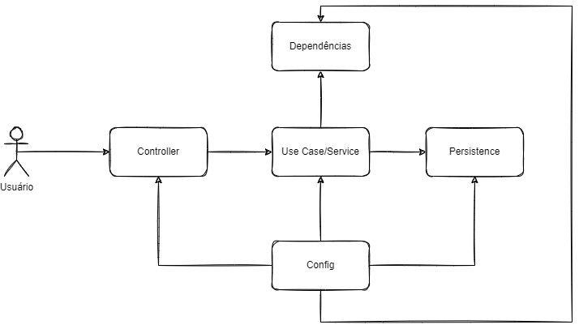

# the simple archtecture

based on: https://dev.to/hugaomarques/a-arquitetura-simples-lb

## principles

YAGNI - you aren't gonna neet it

KISS - keep it super simple xD

`There's no silver bullet`

## layers

### controllers

- input validation
- i/o logging
- transform api input in use case input
- call use case

### use cases or services

- implement business rules with entities
- one by api route or correlated
- handle persistence and external depencies

### entities

- typically sets of values
- can store behaviors that are common for the rest of the application

### external dependencies

- facade or anti corruption layer
- acts as an intermediary to isolate the domain from external systems
- ensuring that any changes to the external require modifications only in this class

### persistence

- class where will concentrate your database operations

### config

- dependency injection framework
- will conect everything

# POC

create users
  - save user in database

create payment
  - save payment in database
  - put on confirmation queue

create a cancellation
  - put on cancellation queue

confirmation
  - async
  - create transactions
  - calculate balance
  - update cache with the balance

get user by id
  - fetch cached user balance -> last updated must be present

